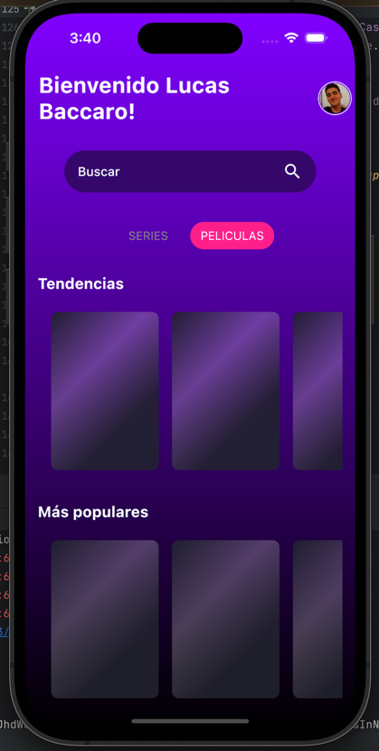
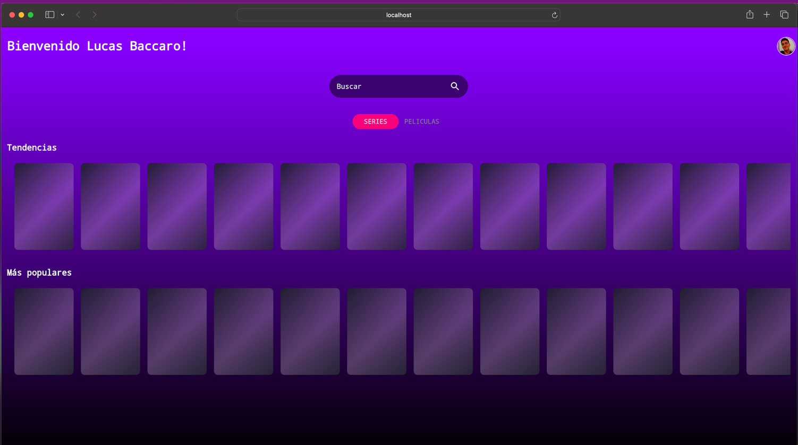
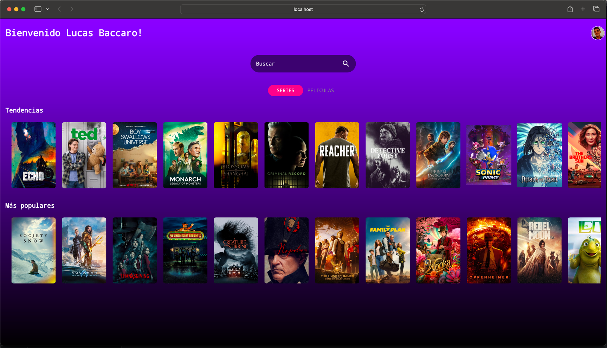
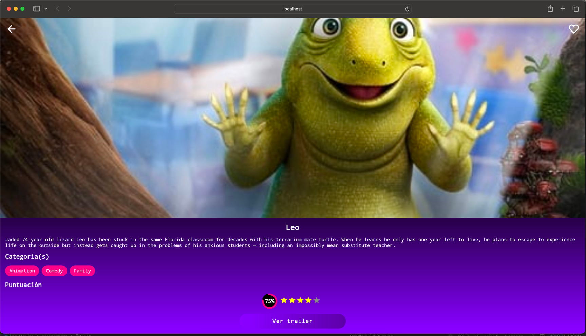
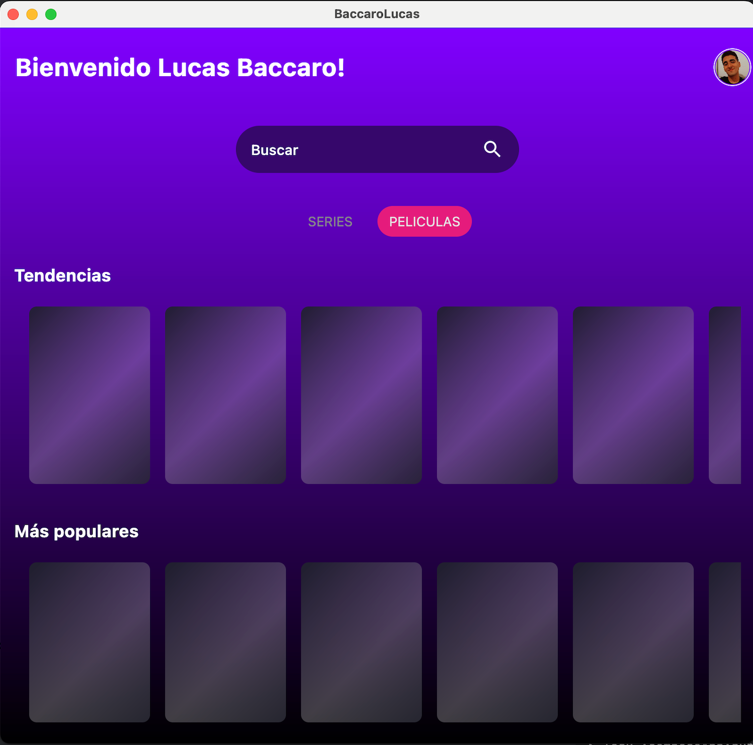
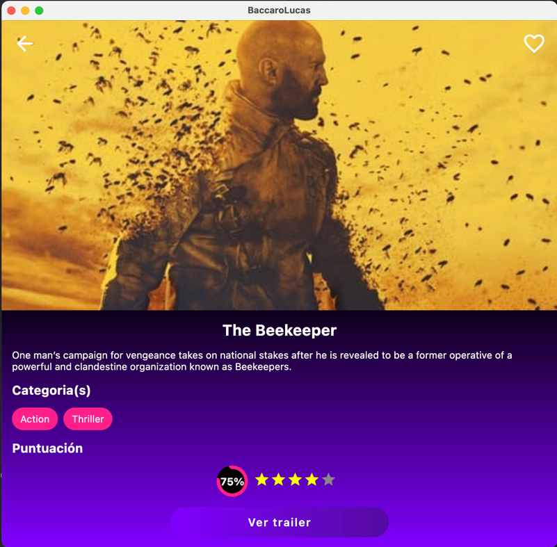

# APP MOVIES

> I used Compose Multiplatform

- [iOS](#ios)
- [Android](#android)
- [Web](#web)
- [Desktop](#desktop)
- [Libraries Used](#libraries-used)

## Libraries Used
- **Ktor:** Used for handling HTTP requests and networking operations.
- **Koin:** A lightweight dependency injection framework.
- **DateTime:** For handling date and time operations.
- **Image Loader:** Efficiently loads and displays images.
- **Precompose:** Utilized for navigation and managing ViewModels in a multiplatform environment.

## iOS
<table>
  <tr>
    <td align="center"></td>
    <td align="center"></td>
  </tr>
  <tr>
    <td align="center"></td>
    <td align="center"></td>
  </tr>
</table>

## Android
<table>
  <tr>
    <td align="center"></td>
    <td align="center"></td>
  </tr>
  <tr>
    <td align="center"></td>
    <td align="center"></td>
  </tr>
</table>

## Web
<table>
  <tr>
    <td align="center"></td>
    <td align="center"></td>
  </tr>
  <tr>
    <td align="center"></td>
    <td align="center"></td>
  </tr>
</table>

## Desktop
<table>
  <tr>
    <td align="center"></td>
    <td align="center"></td>
  </tr>
  <tr>
    <td align="center"></td>
    <td align="center"></td>
  </tr>
</table>
