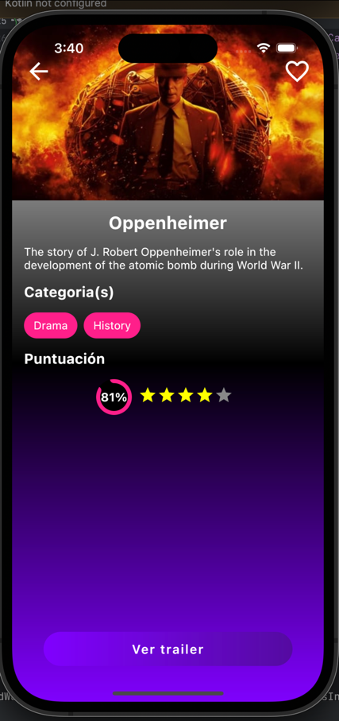
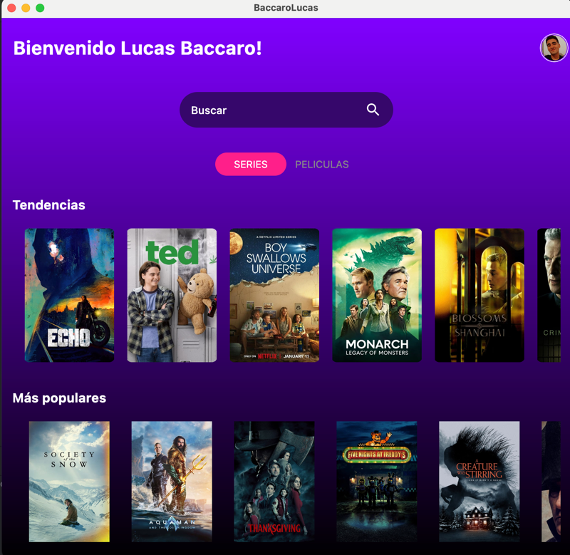

# APP MOVIES

> Compose Multiplatform & Kotlin Multiplatform

- [iOS](#ios)
- [Android](#android)
- [Web](#web)
- [Desktop](#desktop)
- [Libraries Used](#libraries-used)

## Libraries Used
- **Ktor:** Used for handling HTTP requests and networking operations.
- **Koin:** A lightweight dependency injection framework.
- **DateTime:** For handling date and time operations.
- **Image Loader:** Efficiently loads and displays images.
- **Precompose:** Utilized for navigation and managing ViewModels in a multiplatform environment.

## iOS
(iOS specific details or features)

## Android
(Android specific details or features)

## Web
(Web specific details or features)

## Desktop
(Desktop specific details or features)

